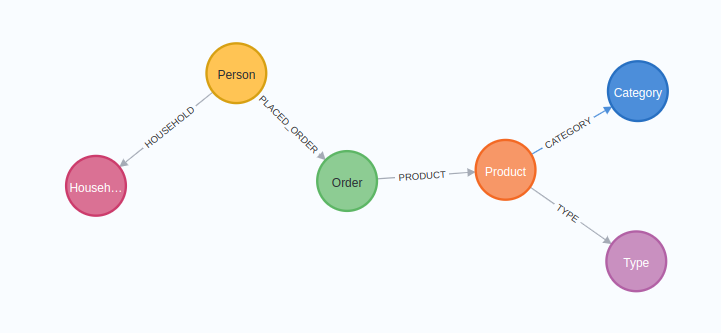
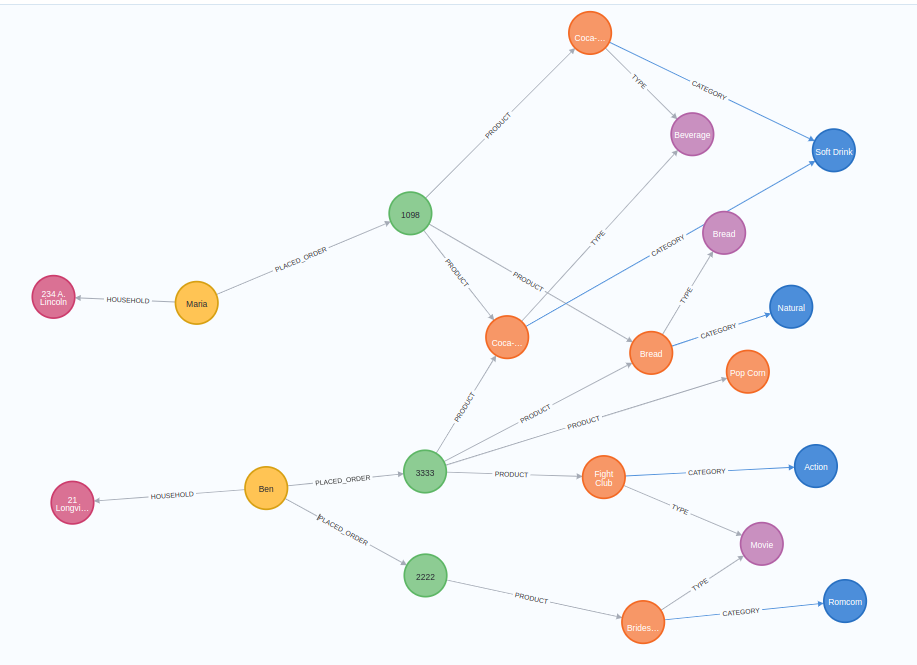

# Build_a_Graph

## Required Tools:  Docker and Python 3.10+

# INSTALL AND LOAD XLSX FILE
## Python 3.10
### prepare a new environments for python (root: nist_Grap directory):
### python3 -m venv venv
### source venv/bin/activate
### pip3 install -r requirements.txt

## Docker
### ------- please change "__your-user__" label with a real value
1. sudo docker run -d --publish=7474:7474 --publish=7687:7687 --env=NEO4J_AUTH=none --volume=/home/__your-user__/dockerback/dock_buildgraph/data:/data neo4j

2. file description (location: files/bag_file001.xlsx)

## Loading file
### To load file into docker execute: 
3. python3 main.py

# Exploring graph database (no user and password)
http://0.0.0.0:7474/browser/   or http://localhost:7474/browser/

# Review complete schema (it depends completely on the loaded file)- Neo4j Command: 
call db.schema.visualization()  

